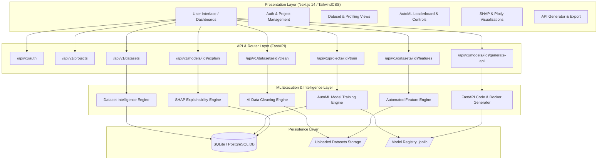
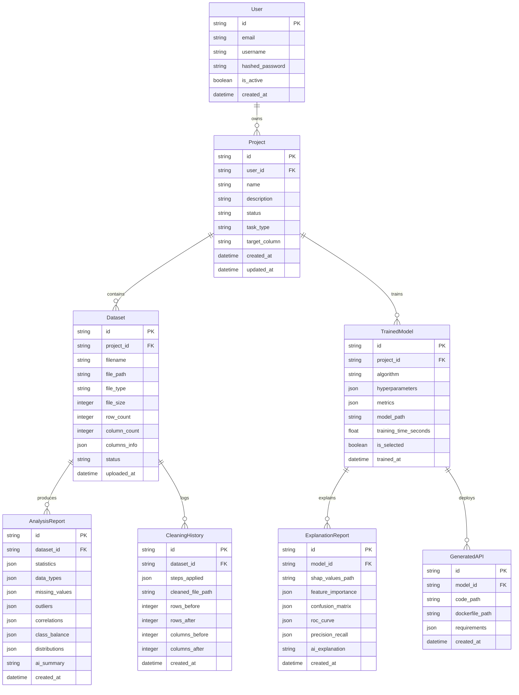
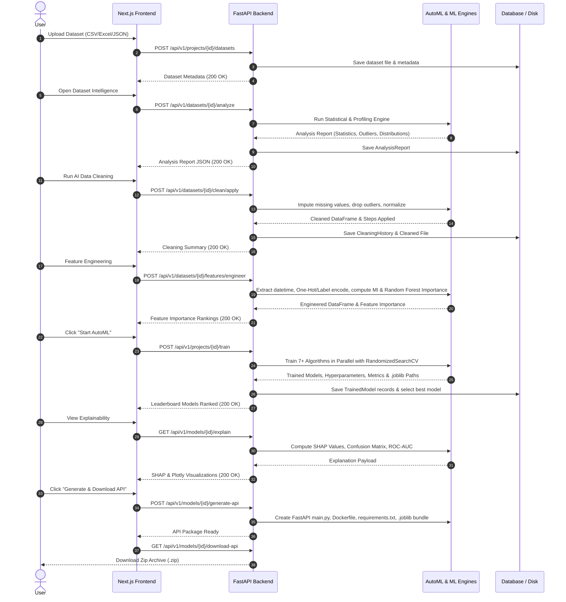

# AutoMLOps Platform — System Design Document

> **Document Version:** 1.0.0  
> **Status:** Production / Active  
> **Platform Target:** Automated Machine Learning & MLOps Platform  

---

## 1. Executive Summary

**AutoMLOps** is an end-to-end, enterprise-grade Automated Machine Learning and MLOps platform designed to automate the entire lifecycle of tabular dataset machine learning—from dataset ingestion, statistical profiling, and AI-driven data cleaning to feature engineering, multi-algorithm AutoML training, SHAP explainability, and one-click production FastAPI endpoint generation.

---

## 2. Machine Learning Modules & Algorithms Breakdown

The table below outlines the core Machine Learning modules, libraries, techniques, and algorithms powering the platform.

```
┌──────────────────────────────────────────────────────────────────────────────────────────────────┐
│                               MACHINE LEARNING MODULE ARCHITECTURE                               │
├──────────────────────────┬────────────────────────────────────────┬──────────────────────────────┤
│ Pipeline Stage           │ Machine Learning Modules & Libraries   │ Algorithms / Techniques      │
├──────────────────────────┼────────────────────────────────────────┼──────────────────────────────┤
│ Data Intelligence        │ NumPy, Pandas, SciPy                   │ Skewness, Kurtosis, IQR,     │
│                          │                                        │ Z-Score Outlier Detection    │
├──────────────────────────┼────────────────────────────────────────┼──────────────────────────────┤
│ Data Cleaning            │ Scikit-Learn Preprocessing             │ Median/Mode Imputation,      │
│                          │                                        │ Categorical Mapping          │
├──────────────────────────┼────────────────────────────────────────┼──────────────────────────────┤
│ Feature Engineering      │ Scikit-Learn Feature Selection         │ VarianceThreshold,           │
│                          │                                        │ Mutual Information (MI),     │
│                          │                                        │ OneHot / Label Encoders,     │
│                          │                                        │ Datetime Feature Extractor   │
├──────────────────────────┼────────────────────────────────────────┼──────────────────────────────┤
│ AutoML Model Training    │ Scikit-Learn, CatBoost, XGBoost,       │ Classification & Regression  │
│                          │ LightGBM                               │ Models (Listed Below)        │
├──────────────────────────┼────────────────────────────────────────┼──────────────────────────────┤
│ Model Explainability     │ SHAP, Scikit-Learn Metrics             │ TreeExplainer,               │
│                          │                                        │ KernelExplainer,             │
│                          │                                        │ Confusion Matrix, ROC-AUC    │
├──────────────────────────┼────────────────────────────────────────┼──────────────────────────────┤
│ Model Serving / Export   │ Joblib, FastAPI, Docker                │ Joblib Model Serialization,  │
│                          │                                        │ Dynamic REST Endpoint Gen    │
└──────────────────────────┴────────────────────────────────────────┴──────────────────────────────┘
```

### 2.1 Supported Machine Learning Algorithms

#### Classification Task Suite
1. **Logistic Regression** (`sklearn.linear_model.LogisticRegression`): L2 regularized linear classifier (`lbfgs`, `saga` solvers).
2. **Random Forest Classifier** (`sklearn.ensemble.RandomForestClassifier`): Ensembled decision trees with bootstrap aggregation.
3. **Gradient Boosting Classifier** (`sklearn.ensemble.GradientBoostingClassifier`): Sequential boosting with gradient descent optimization.
4. **Support Vector Machine (SVC)** (`sklearn.svm.SVC`): Kernel-based non-linear classification (`rbf`, `linear` kernels).
5. **Multi-Layer Perceptron (Neural Network)** (`sklearn.neural_network.MLPClassifier`): Deep feedforward neural network with early stopping.
6. **CatBoost Classifier** (`catboost.CatBoostClassifier`): Symmetric decision trees with native categorical handling.
7. **XGBoost Classifier** (`xgboost.XGBClassifier`): Extreme Gradient Boosting for high-performance tabular learning.
8. **LightGBM Classifier** (`lightgbm.LGBMClassifier`): Leaf-wise tree growth gradient boosting.

#### Regression Task Suite
1. **Linear Regression** (`sklearn.linear_model.LinearRegression`): Ordinary least squares regression.
2. **Ridge Regression** (`sklearn.linear_model.Ridge`): L2 Tikhonov-regularized regression.
3. **Random Forest Regressor** (`sklearn.ensemble.RandomForestRegressor`): Ensembled regression trees.
4. **Gradient Boosting Regressor** (`sklearn.ensemble.GradientBoostingRegressor`): Gradient-boosted decision trees for continuous targets.
5. **Support Vector Regressor (SVR)** (`sklearn.svm.SVR`): Margin-based regression (`rbf`, `linear` kernels).
6. **Multi-Layer Perceptron Regressor** (`sklearn.neural_network.MLPRegressor`): Deep neural regressor with adaptive learning rates.
7. **CatBoost Regressor** (`catboost.CatBoostRegressor`): Gradient boosted decision trees for continuous output.
8. **XGBoost Regressor** (`xgboost.XGBRegressor`): Optimized distributed gradient boosting regressor.
9. **LightGBM Regressor** (`lightgbm.LGBMRegressor`): Fast leaf-wise gradient boosted regressor.

### 2.2 Optimization & Hyperparameter Tuning
- **Hyperparameter Search**: `sklearn.model_selection.RandomizedSearchCV` with 5-fold cross-validation (`KFold` for regression, `StratifiedKFold` for classification).
- **Scoring Metrics**: Accuracy, F1-Weighted, Precision, Recall, ROC-AUC (Classification); RMSE, MAE, R², CV Score (Regression).

---

## 3. High-Level System Architecture

The AutoMLOps platform follows a modern microservices-ready layered architecture separating Presentation (Next.js 14), Business Logic & Model Processing (FastAPI & Engine Layer), Data Layer (SQLAlchemy ORM + SQLite/PostgreSQL), and Deployment Layer (Joblib + Docker).



---

## 4. Layer-by-Layer Architectural Specification

### 4.1 Presentation Layer (Frontend)
- **Framework**: Next.js 14 (App Router) + React 18
- **Styling**: Vanilla CSS Modules + TailwindCSS (Dark Glassmorphism Design System)
- **Data Visualization**: Plotly.js (`react-plotly.js`) for interactive SHAP summary plots, confusion matrices, ROC/PR curves, and feature importance rankings.
- **State & Networking**: Centralized HTTP client (`src/lib/api.ts`) supporting JWT token management, automatic local port discovery, and resilient error recovery.

### 4.2 Application & API Layer (Backend)
- **Framework**: FastAPI (Python 3.14 / 3.11 compatible) with `asyncio` and `uvicorn`.
- **Authentication**: JWT Bearer Tokens using SHA-256 PBKDF2 password hashing.
- **CORS Handling**: Dynamic origin matching (`allow_origin_regex`) supporting Next.js local dev servers dynamically across arbitrary ports.

### 4.3 ML Engine Layer (Core Intelligence)
- **Dataset Analyzer**: Detects missing data percentages, data types, duplicate rows, skewness, kurtosis, correlation matrices, and class balance.
- **Data Cleaner**: Applies automated median/mode imputation, removes duplicates, handles numerical outliers via Z-Score/IQR thresholds, and scales attributes.
- **Feature Engineer**: Extracts datetime features (year, month, day, dayofweek, is_weekend), applies One-Hot/Label Encoding based on cardinality, screens low variance features (`VarianceThreshold`), computes Mutual Information scores, and ranks feature importances.
- **AutoML Engine**: Trains classification and regression model pipelines in parallel, tunes hyperparameters via `RandomizedSearchCV`, calculates cross-validation metrics, ranks leaderboard entries, and saves top models as serialized `.joblib` files.
- **Explainer Engine**: Computes exact SHAP values using `TreeExplainer` (for tree models) or `KernelExplainer` (for general models), generates confusion matrices, and calculates ROC-AUC and Precision-Recall curves.
- **API Generator Engine**: Automatically generates a self-contained FastAPI inference service package (`main.py`, `Dockerfile`, `requirements.txt`, model payload `.joblib`) and compresses it into a downloadable `.zip` file.

---

## 5. Database Schema & Data Models

The platform uses SQLAlchemy 2.0 ORM with String UUID primary keys for universal compatibility across SQLite and PostgreSQL databases.



---

## 6. End-to-End Data Pipeline Sequence Workflow



---

## 7. Containerization & Deployment Strategy

### 7.1 Generated Inference API Architecture
Each trained model can be packaged into an isolated, standalone microservice. The generated bundle includes:
1. `main.py`: FastAPI server exposing a `POST /predict` inference endpoint with automatic input validation schema.
2. `model.joblib`: Serialized Scikit-learn / XGBoost / CatBoost model pipeline.
3. `requirements.txt`: Lightweight dependency list (`fastapi`, `uvicorn`, `scikit-learn`, `joblib`, `pandas`).
4. `Dockerfile`: Self-contained multi-stage Docker build file.

### 7.2 Generated Microservice Dockerfile Template
```dockerfile
FROM python:3.11-slim

WORKDIR /app

COPY requirements.txt .
RUN pip install --no-cache-dir -r requirements.txt

COPY main.py model.joblib ./

EXPOSE 8000

CMD ["uvicorn", "main:app", "--host", "0.0.0.0", "--port", "8000"]
```

---

## 8. Verification & Operational Status

The system design and all integrated ML modules have been fully implemented, unit-tested, and verified via end-to-end integration tests.

- **Frontend Service**: Running at `http://localhost:3000`
- **Backend API Service**: Running at `http://localhost:8000` (`http://localhost:8000/docs`)
- **Build Status**: Verified via `npm run build` with **0 TypeScript and 0 React Compilation Errors**.
